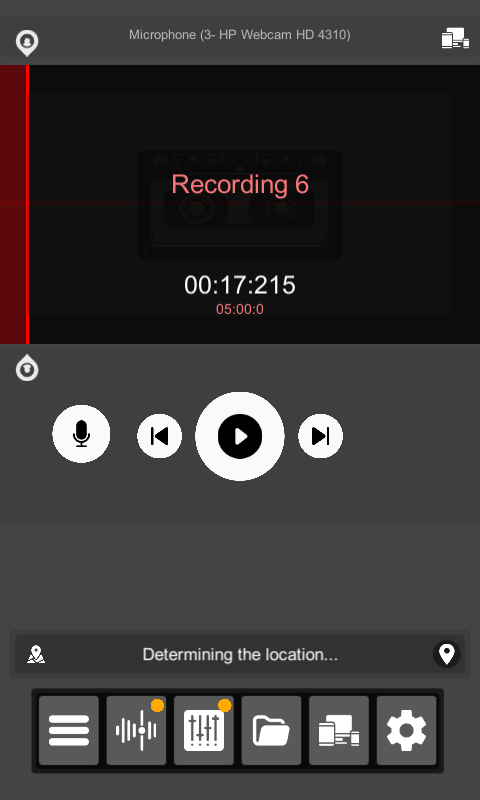
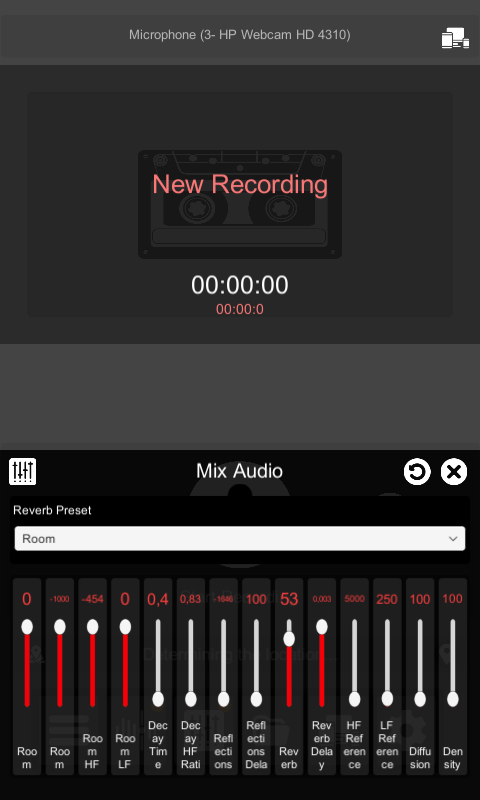
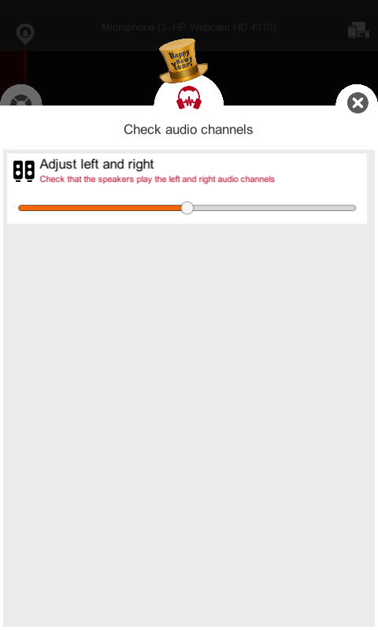

**Ultra Record - Redefining Audio Recording, One Feature at a Time!**  

Looking for an audio recording app that’s not just simple but also powerful, professional, and packed with creativity? **Ultra Record** is the ultimate solution tailored just for you!

With **Ultra Record**, everything you need for seamless audio recording is in one place:  
✨ **Select Input Devices with Ease**: Flexibly choose your recording source, whether it’s an external microphone, USB device, or any input you prefer.  
✨ **Smart Audio Filters**: Eliminate background noise and enhance quality, delivering crystal-clear audio akin to professional studios.  
✨ **Immersive Spatial Simulations**: Transform ordinary recordings into dynamic audio experiences tailored to environments like auditoriums, living rooms, or outdoor spaces.  

✨ **Customizable Recording Options**: Adjust playback speed, reverb, and balance effortlessly to ensure every recording sounds perfect.  
✨ **Left-Right Audio Channel Testing**: Verify your device’s audio channels to ensure optimal performance with every setup.  

✨ **Effortless File Export & Playback**: Supports multiple audio formats, allowing you to share and use your recordings anywhere, anytime.  

More than just an app, **Ultra Record** is your partner in discovering, creating, and preserving valuable audio moments. Whether for work, study, or leisure, Ultra Record guarantees an experience beyond your expectations.  

**Download Ultra Record today and start your audio journey like never before!**